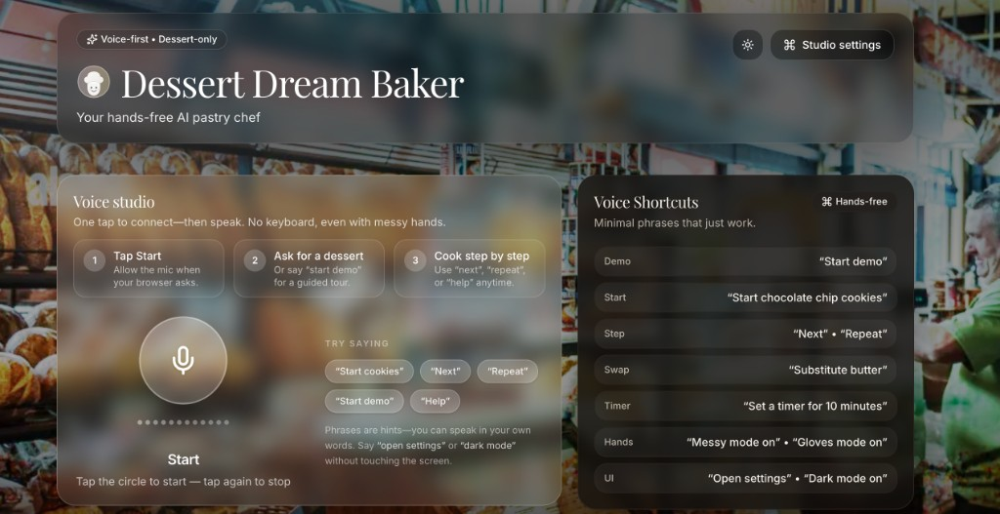

# ElevenHacksxCursor-DessertDreamBaker

## Overview



**Dessert Dream Baker** is a hands-free pastry chef for the Cursor × ElevenLabs Hackathon. The UI is built around **Voice studio**: tap once to connect the mic, then speak naturally for recipes, demos, timers, and shortcuts—while **Voice shortcuts** lists phrases you can say without touching the screen (messy hands, gloves mode, settings, and more). Under the hood it uses **only ElevenLabs product APIs**: **Scribe** realtime speech-to-text, streaming **TTS**, **sound effects**, optional **instant voice clone**, plus local recipe logic—no ConvAI agent.

🍪 Talk through cakes, cookies, pies, and no-bake treats with real-time guidance—no typing, just voice while your hands are covered in flour.

## ✨ Key Features

Natural Voice Conversations — Say things like "Walk me through chocolate chip cookies with what I have" or "Is it golden yet?"
Real-time Smart Adjustments — Ingredient substitutions, oven temp conversions, dietary swaps, and doneness checks
Dramatic ElevenLabs Audio Experience:
Expressive TTS (Flash v2.5 + v3)
Instant voice cloning (your voice or a fun chef/grandma persona)
Rich sound effects — mixer whirring, butter sizzling, oven dings, celebratory sparkles

Step-by-step guidance with interruptions, repeats, and timer announcements
Delightful & Kitchen-Friendly UI (but fully usable eyes-closed)

## 🛠 Built With

Cursor (AI-first coding)
ElevenLabs (Scribe STT + Streaming TTS + Sound Effects + Voice Cloning)
Next.js 15 + TypeScript + Tailwind
Fully voice-first architecture

## 🎯 Hackathon Goal
Created as an entry for Cursor × ElevenLabs Hackathon to showcase the full power of voice AI in the kitchen — making baking fun, accessible, and truly hands-free.

## 🚀 Run locally

### Prereqs

- Node.js 20+
- An ElevenLabs API key

### Setup

1) Install dependencies

```bash
npm install
```

2) Configure env vars

```bash
cp .env.example .env.local
```

Set these in `.env.local`:

- `ELEVENLABS_API_KEY`
- `ELEVENLABS_TTS_VOICE_ID` (default voice for chef TTS when not using a clone)

Optional:

- `ELEVENLABS_BASE_URL` (use if you’re on a residency base URL)

3) Start the app

```bash
npm run dev
```

Open `http://localhost:3000`, press **Start (Hands-free)**, grant microphone access, and talk naturally.

If you see **Failed to get Scribe token**, open **DevTools → Network**, select `/api/eleven/scribe-token`, and read the JSON `error` field. Almost always: **`ELEVENLABS_API_KEY` missing or wrong** in `.env.local`, or the dev server wasn’t restarted after editing env vars.

### Push env vars to Vercel (CLI)

From the repo root, with the [Vercel CLI](https://vercel.com/docs/cli) installed and the project linked (`vercel link`):

1. Fill **`.env.local`** (never commit it) with the same keys as `.env.example`.
2. Run **`npm run vercel:push-env`** — it runs `scripts/push-env-to-vercel.mjs`, which calls `vercel env add … --force` for **production** and **preview** for `ELEVENLABS_API_KEY`, `ELEVENLABS_TTS_VOICE_ID`, and optional `ELEVENLABS_BASE_URL`.
3. Trigger a new deployment so serverless functions pick up the values.

One-off examples:

```bash
vercel env add ELEVENLABS_API_KEY production --value "sk_your_key" --yes --sensitive
vercel env add ELEVENLABS_TTS_VOICE_ID production --value "your_voice_id" --yes
```

## 🧠 How the voice loop works (core)

- **Scribe v2 Realtime (Speech-to-Text)**: browser microphone → live partial transcript → committed transcript
- **Chef lines (local)**: `POST /api/eleven/chef-turn` returns short dessert-chef copy from **recipe + command logic** in `src/lib/chefReply.ts` (no ElevenLabs ConvAI agent)
- **Text-to-Speech**: the assistant reply is played with **`POST /api/eleven/tts`** (default voice from `ELEVENLABS_TTS_VOICE_ID`, or your clone when enabled)
- **Sound Effects API**: optional SFX at key “baking moments” (mixing, oven, butter, etc.)

Server routes:

- `POST /api/eleven/chef-turn` → plain-text chef reply (local templates)
- `GET /api/eleven/scribe-token` → single-use token for Scribe realtime
- `POST /api/eleven/tts` → streaming TTS audio
- `POST /api/eleven/sound-effect` → generate SFX audio from a prompt

## 🔐 Security

Your ElevenLabs API key stays server-side only. The browser receives:

- a **single-use token** for Scribe
- **audio** from TTS and sound-effect routes (no API key in the client)

## Next steps (planned)

- Voice cloning onboarding (record 10–20s → create voice → use as persona)
- Dessert recipe memory + substitutions DB + step state machine
- Dramatic timers + countdown SFX choreography
